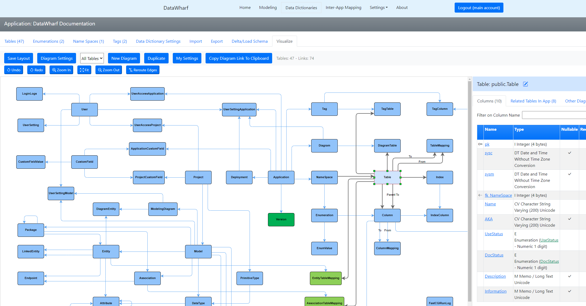
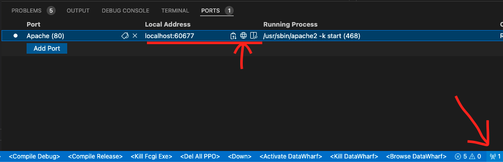

# DataWharf&trade;
DataWharf is a Database Designer/Modeler/Analyzer Tool web application.  

View [ChangeLog.md](ChangeLog.md) for list of enhancements and fixes.   

View [Data Architecture and Modeling with DataWharf Article](https://harbour.wiki/index.asp?page=PublicArticles&mode=show&id=230224232407&sig=5928045156) for User and Developer documentation   

View [Data Architecture and Modeling with DataWharf Presentation Deck (Slides)](https://github.com/EricLendvai/DataWharf/blob/main/Presentation/Intro_To_DataWharf.pdf)   

# YouTube Videos
  * [Data Architecture and Modeling with DataWharf](https://www.youtube.com/watch?v=8GfwKYA4Agc)
  * [Tutorial - Installing DataWharf Locally](https://www.youtube.com/watch?v=Gc_Vib6_3is)

# YouTube Channel
[https://www.youtube.com/@EricLendvai](https://www.youtube.com/@EricLendvai)   

Sample screen of Data Dictionary Visualization 


# Running DataWharf using Docker
## Overview
For Windows and Mac users, the easiest is to Install Docker Desktop.   
For Windows users you can use the following article to learn how to [setup WSL, Docker Desktop](https://harbour.wiki/index.asp?page=PublicArticles&mode=show&id=221022022831&sig=9123873596)   
If you don't already have access to a PostgreSQL server, install version 14 or above on your local machine.   
Create an empty database "DataWharfDemo" for example and update the file "config_demo.txt" with PostgreSQL connection and login information.   
There are 3 different ways to build a docker container. The slowest, but most up to date method is to use the docker file "Dockerfile_Demo_Complete_Ubuntu_Latest".   
"Dockerfile_Demo_Complete_Ubuntu_Latest_With_Builder" will create a smaller image.   
The fastest method to build a docker image is to use "Dockerfile_Demo_Using_DockerHub_Ubuntu_22_04". DataWharf will use less than 30 Mb of ram at first.   
The current builds are using Ubuntu 22.04.   
The following commands can be used to create a docker image and start it, assigning port 8080.   

```
docker build . -f build/docker/Dockerfile-Ubuntu -t datawharf_demo_using_dockerhub_baseimage:latest --target datawharf
docker run -d -p 8080:80 datawharf_demo_using_dockerhub_baseimage:latest
```

Optionally you could add  "--no-cache" to force complete rebuilds.

Open a browser to "http://localhost:8080"   
The initial login ID is "main" and the password is "password".   
Once you logged in, to see DataWharf's own data dictionary use the following steps:   
1. Go to "Settings" and add an "Application", "DataWharf".   
2. Go to "Data Dictionary", select "DataWharf", use the "Import" option, and from the repo use the latest ExportDataDictionary_DataWharf_*.zip   
You can do the same for "Projects" and "Models".   

## Step by Step instructions
Review the following [Instructions to install DataWharf using docker](Instructions_to_install_DataWharf_using_docker.md)   
This method will require access to https://hub.docker.com/ since it will download the latest build version of DataWharf.   

# Open Source
The following is the list of additional open source projects used to design, build and deploy DataWharf:

| Repo / Website  | Use |
| ------------- | ------------- |
| https://github.com/harbour/core                | The Habour to C Compiler |
| https://github.com/EricLendvai/Harbour_FastCGI | FastCGI web framework |
| https://github.com/EricLendvai/Harbour_ORM     | Database framework |
| https://github.com/EricLendvai/Harbour_VFP     | Additional Harbour/VFP Language Libraries |
| https://www.postgresql.org/                    | Main data store of the web app |
| https://httpd.apache.org/                      | Apache Web server |
| https://getbootstrap.com/                      | Bootstrap 5 |
| https://jquery.com/                            | Browser independent JavaScript library |
| https://jqueryui.com/                          | UI toolkit for jQuery |
| https://github.com/visjs/vis-network           | JavaScript Library used to make interactive diagrams (visualize) |
| https://github.com/maxGraph/maxGraph           | JavaScript Library used to make interactive diagrams (visualize) |
| https://code.visualstudio.com/                 | Also used to automate compilation |

DataWharf can run on Windows, Linux or any platforms supported by the above list of repos/products.

View [Todo.md](Todo.md) for list of upcoming fixes and enhancements.

# VS Code Devcontainer
In order to develop in any environement you can use the VS Code devcontainer provided in this repo.
Install remote containers extension: https://aka.ms/vscode-remote/download/containers
For Windows users you can use the following article to learn how to [setup WSL, Docker Desktop](https://harbour.wiki/index.asp?page=PublicArticles&mode=show&id=221022022831&sig=9123873596)

## How to setup on a Mac with Lima instead of Docker Desktop
Source: [here](https://georgik.rocks/how-to-develop-for-esp32-c3-with-rust-on-macos-with-lima-using-dev-container-in-vs-code/)

Install Lima and Docker-CLI:
```
brew install lima docker
```

Create Linux VM with Dockerd:

```
curl https://raw.githubusercontent.com/lima-vm/lima/master/examples/docker.yaml -O
limactl start ./docker.yaml
limactl shell docker
sudo systemctl enable ssh.service
```
There is one important tweak in the Lima configuration. It’s necessary to enable write operation otherwise, the workspace mounted from VS Code is read-only. Open file `~/.lima/docker/lima.yaml` and add writable flag to desired folder:
```
mounts:
- location: "~"
  writable: true
```
Restart Lima to apply changes.
```
limactl stop docker
limactl start docker
```

Create context for Docker-CLI to connect to dockerd running in the VM:


```
docker context create lima --docker "host=unix://${HOME}/.lima/docker/sock/docker.sock"
docker context use lima
```


## Build and run project
- Reopen the folder in the dev container: press `F1` and then do `>Remote-Containers: Open Folder in Container...`
- You can now use the following tasks defined by VS Code to compile/debug:
  - `<Compile Debug>`: Compiles with debug settings and deployes the executable inside the backend part of the apache website: `/var/www/Harbour_websites/fcgi_DataWharf/backend/`. (Note: only the exe will be copied there for now, changes done to website parts such as `.js` or `.css` files need to be copied there manually).
  - `<Compile Release>`: Build without debug settings.
  - `<Debug>`: Attaches to the running executable inside Apache.
- Go to `Ports` view and open the port that exposes port `80` on the host (e.g., http://localhost:60677)


## Database
- The PostgreSQL DB is also accessible from the host via the exposed port `5432`.
- Using e.g., PGAdmin you can connect using the following credentials:
  - Host: `localhost`
  - Port: `5432`
  - Username: `datawharf`
  - Password: `mypassord`
